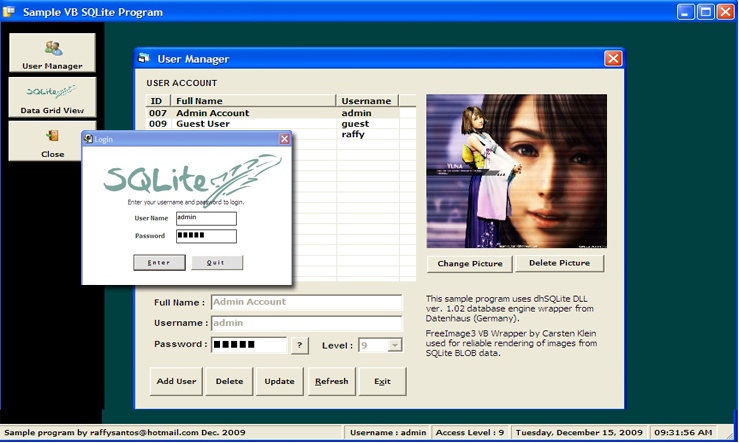



## SQLite VB Sample

### Description

SQLite VB Sample

----

This is a sample program for SQLite database using dhRichClient3 db engine and FreeImage for

rendering BLOB image data. It contains a simple user management module within an MDI

container that can be used as a template for further application development.

Requirements:

1) dhRichClient3.dll (COM-Dll, current version 3.0.19) and sqlite36_engine.dll (StdCall-compile of sqlite-version 3.6.20) both are included in the Toolset-Binaries: (ca. 1.3MB) download from http://www.datenhaus.de/Downloads/dhRichClient3.zip.

2) FreeImage.dll - download from http://downloads.sourceforge.net/freeimage/FreeImage3130Win32.zip.

--raffysantos @ hotmail . com

9:29 AM 12/15/2009
 
### More Info
 

             |
---                |---
**Submitted On**   |2009-12-13 06:51:04
**By**             |[Raffy S\. Santos](https://github.com/Planet-Source-Code/PSCIndex/blob/master/ByAuthor/raffy-s-santos.md)
**Level**          |Beginner
**User Rating**    |5.0 (10 globes from 2 users)
**Compatibility**  |VB 6\.0
**Category**       |[Databases/ Data Access/ DAO/ ADO](https://github.com/Planet-Source-Code/PSCIndex/blob/master/ByCategory/databases-data-access-dao-ado__1-6.md)
**World**          |[Visual Basic](https://github.com/Planet-Source-Code/PSCIndex/blob/master/ByWorld/visual-basic.md)
**Archive File**   |[SQLite\_VB\_21703412142009\.zip](https://github.com/Planet-Source-Code/raffy-s-santos-sqlite-vb-sample__1-72738/archive/master.zip)

